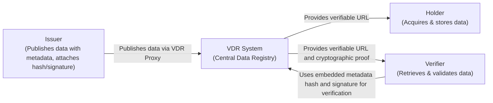
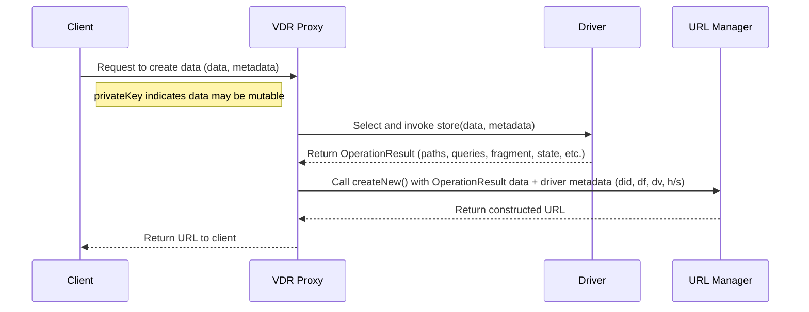
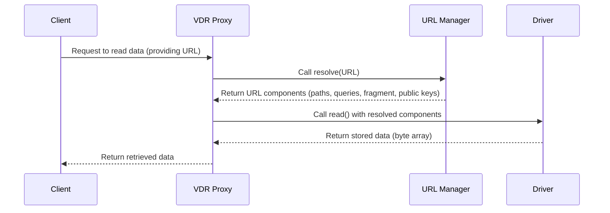
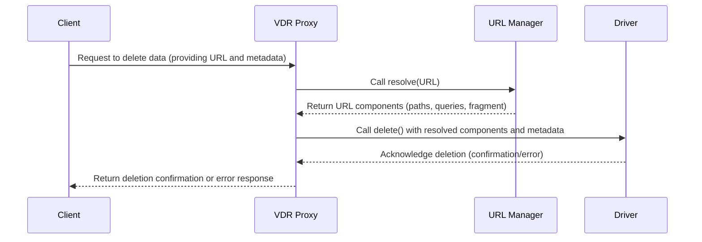
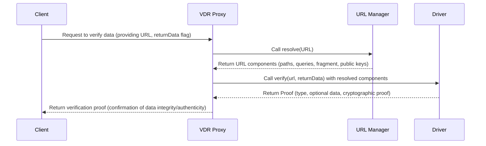

# VDR System Technical Specification

This document specifies the architecture, components, and data model for the Verifiable Data Registry (VDR) system. It provides technical details for implementers and integrators.

---

## Authors and Contributors

This document is developed and maintained by a dedicated team of authors and editors committed to advancing the Verifiable Data Registry (VDR) system. 
Contributions from the community are welcome and encouraged. 
Please refer to our [Contribution Guidelines](https://github.com/hyperledger-identus/vdr/CONTRIBUTING.md) for further details on how you can contribute.

### Authors

- **Gonçalo Frade** <br>
  IOG Engineer <br>
  [goncalo.frade@iohk.io](mailto:goncalo.frade@iohk.io) <br>
  [github](https://github.com/goncalo-frade-iohk)

### Maintainers

- **Identus team** <br>
  [Mantainers](https://github.com/orgs/hyperledger-identus/teams/identus-maintainers)

### Topics

- **Topics and Discussions** <br>
  [Discussions](https://github.com/hyperledger-identus/vdr/discussions) <br>
  [Discord](https://discord.gg/6MRXXxmBkw)

### Version Information

- **Version:** 0.1
- **Release Date:** 2025-03-19

### Contribution

We value contributions from the community. 
If you would like to contribute, please review our [Contribution Guidelines](https://github.com/hyperledger-identus/vdr/CONTRIBUTING.md) for more information on the process and requirements.

---

## 1. Abstract

The Verifiable Data Registry (VDR) system provides a unified API for storing, mutating, retrieving, and removing data. 
The system decouples the application layer from underlying storage mechanisms by leveraging pluggable components: **Drivers** and **URL Managers**. 
This specification defines the roles, relationships, and data model used by these components, as well as standard URL query parameters that facilitate driver selection and data integrity verification.

---

## 2. Introduction

The VDR system is designed to enable verifiable data operations across various storage backends such as databases, blockchains, or in-memory storage. 
It also supports flexible URL construction and parsing for addressing stored data. 
Through its modular architecture, the system can adapt to different technologies and deployment environments.

Key components include:

- **VDR Proxy**: The entry point that mediates client requests and delegates operations.
- **Drivers**: Plugins that implement the actual data storage and retrieval logic.
- **URL Managers**: Modules that construct and resolve URLs carrying essential metadata.

Future enhancements include a centralized registry for Drivers and URL Managers to facilitate dynamic discovery and management.

---

## 3. Actors

### 3.1 Issuers

In the VDR ecosystem, Issuers are the primary sources of verifiable data. 
They generate the data and then publish it into the system along with the required metadata. 
This metadata—such as driver identifiers, driver family, and driver version—is critical for ensuring that any consumer can later retrieve and verify the data. 
When the data is intended to be mutable, Issuers sign the data using their private keys, indicating that updates may occur in the future. 
For immutable data, a cryptographic hash is computed and attached, ensuring that any alteration can be detected immediately. 
The Issuer's role is foundational, as they not only establish the data’s integrity and authenticity but also guarantee that the associated metadata is both accurate and complete.

### 3.2 Holders

Holders are consumers who acquire and store verifiable data for their own use. 
They might download and cache data to maintain personal records or build a history of transactions that can be referenced later. 
For Holders, ensuring the integrity and authenticity of the data is paramount. 
The data they store is expected to remain unaltered unless explicitly updated by the Issuer, which allows them to trust that the historical record remains accurate over time. 
By preserving this information, Holders support a reliable audit trail and provide a basis for subsequent verification and analysis.

### 3.3 Verifiers

Verifiers are consumers whose primary responsibility is to validate the authenticity and integrity of the data published by Issuers. 
These parties often act as independent third parties, relying on the data for critical decision-making. 
They retrieve data from the VDR using URLs provided by the Issuers and then use the embedded metadata—such as the SHA256 hash for immutable data or the digital signature for mutable data—to perform independent verification. 
This process confirms that the data has not been tampered with and complies with the established trust frameworks or regulatory standards. 
By doing so, Verifiers play a crucial role in creating a trustless environment, where multiple parties can confidently rely on the data without the need for a centralized authority.


This diagram illustrates the core relationships among the actors within the VDR system. 
The **Issuer** generates and publishes data along with the required metadata—attaching either a cryptographic hash for immutable data or a digital signature for mutable data—via the VDR Proxy. 
The **VDR System** then stores this data and issues verifiable URLs that encapsulate the necessary metadata and proofs. 
**Holders** retrieve these URLs to acquire and store the data for personal records, while **Verifiers** use the provided URLs and embedded cryptographic proofs to independently validate the data's integrity and authenticity. 
This architecture fosters a trustless environment where data integrity is maintained through robust, decentralized verification.

## 4. Problem Statement

In an era where data is generated and consumed at unprecedented scales, ensuring the authenticity and integrity of publicly available data has become a critical challenge. 
Many systems rely on centralized authorities to manage data storage and verification, which introduces single points of failure and can compromise trust. 
This is particularly problematic in environments where multiple independent parties require confidence in the data they consume, such as in supply chain management, digital identity, financial records, and open government data.

### 4.1 Key Challenges

- **Decentralized Verification:**  
  Traditional systems often centralize control, making it difficult for external parties to verify that the data has not been tampered with. A lack of transparency in data storage mechanisms undermines trust and limits the ability of stakeholders to independently authenticate information.

- **Data Integrity and Authenticity:**  
  Public data must be resilient to unauthorized modifications. In many cases, verifying the integrity of data after retrieval is cumbersome or relies on ad-hoc mechanisms. Without robust cryptographic verification (e.g., through hashes or digital signatures), it becomes challenging for multiple parties to ensure that the data they retrieve is exactly as it was originally stored.

- **Interoperability and Flexibility:**  
  The diversity of storage technologies—from centralized databases to distributed ledger systems and in-memory caches—creates fragmentation. A solution is needed that can abstract these differences and provide a unified, interoperable interface for data storage and retrieval. Such a solution must be flexible enough to accommodate various storage backends while ensuring that the verification process remains consistent across implementations.

- **Scalability and Trustless Collaboration:**  
  In many modern applications, data is produced by one party and consumed by many. Ensuring that each consumer can independently verify the data without relying on a centralized intermediary is essential. A scalable solution must support trustless collaboration, where the integrity and provenance of data can be verified by all stakeholders without compromising performance or security.

### 4.2 How VDR Addresses These Challenges

The Verifiable Data Registry (VDR) is designed to solve these complex problems by providing a modular, extensible framework that decouples data operations from the underlying storage mechanisms. Its architecture supports the following:

- **Consistent and Verifiable Data Operations:**  
  The VDR establishes a uniform interface for storing, updating, retrieving, and verifying data, irrespective of the underlying storage solution. By abstracting these operations through pluggable components (Drivers and URL Managers), the system ensures that all data can be processed using consistent methods, whether stored in a local database, in-memory store, or on a decentralized network.

- **Integrity Verification:**
  The system employs cryptographic techniques to ensure data integrity. For immutable data, a SHA256 hash is computed and embedded as a URL query parameter. For mutable data, a digital signature is used to confirm that any updates are authenticated by the originating party. This dual approach guarantees that data integrity is maintained regardless of whether the data is subject to change.

- **Interoperability through Modular Components:**  
  By abstracting the storage and retrieval mechanisms into pluggable components (Drivers and URL Managers), the VDR provides a unified API that can integrate with various storage technologies. This design allows the system to adapt to different backend implementations while maintaining consistent methods for data verification and access.

- **Extensible Metadata and Query Registries:**  
  The system introduces registries for both URL query parameters and metadata keys. These registries ensure that all necessary information for verifying and retrieving data (such as driver identifiers, families, and versions) is consistently used across the system. This extensibility makes it easier to introduce new verification mechanisms and adapt to emerging data integrity challenges.

- **Trustless Environment for Multi-party Verification:**  
  The VDR supports an ecosystem where multiple parties can independently verify the authenticity of stored data. This trustless environment reduces the reliance on any single party for data verification, enhancing security and fostering collaboration in scenarios where data integrity is paramount.

---

## 5. Terminology

The following terms are used throughout this specification:

- **VDR**: Verifiable Data Registry – a system that offers a unified API for data operations.
- **Driver**: A plugin responsible for implementing data storage, mutation, retrieval, and removal.
- **URL Manager**: A component that constructs and resolves URLs used to reference stored data.
- **OperationResult**: The outcome of a storage operation, containing metadata such as operation state, paths, queries, and fragments.
- **Query Parameters Registry**: A registry of URL components that carry metadata for driver selection and data integrity verification.
- **Metadata Registry**: A registry of metadata keys used throughout the system. This registry is designed to be extensible, similar to the URL query parameters registry.

---

# 6. Architectural Overview

The VDR system is composed of several core components that work together to perform data operations. In this section, we detail how the components interact for each primary task: storing, mutating, retrieving, and removing data, with special consideration for handling mutable data.

## 6.1 Component Responsibilities

### 6.1.1 VDR Proxy (VDR Interface)

The VDR Proxy serves as the central coordinator of the entire system. 
It is the primary entry point for client requests and is responsible for orchestrating the flow of data through the system. 
When a client submits a request—whether to create, update, read, delete, or verify data—the VDR Proxy first validates the incoming metadata and ensures that all necessary parameters are present. 
This component then selects the appropriate Driver based on the URL query parameters or metadata provided by the client.
Overall, the VDR Proxy plays a pivotal role in maintaining the integrity of the data flow by ensuring that each request is directed to the correct component for further processing.

  - Acts as the central coordinator for all data operations.
  - Receives client requests and delegates the tasks to appropriate Drivers and URL Managers.
  - Validates metadata and selects the correct Driver based on URL query parameters.

### 6.1.2 Driver Interface

The Driver Interface is at the heart of the actual data operations within the VDR system. 
Drivers are the pluggable components that implement the storage mechanisms, which could range from traditional databases to blockchain-based systems or in-memory storage solutions. 
When a client request is delegated by the VDR Proxy, the appropriate Driver is tasked with executing the requested operation. 
This includes creating new data entries, updating existing data, retrieving stored data, or deleting data.
Each Driver returns an `OperationResult` object that encapsulates detailed information about the operation, including storage paths, query parameters, fragments, and any relevant public keys. 
Additionally, Drivers are responsible for handling errors internally and for communicating any issues by setting the appropriate state in the `OperationResult`. 
For mutable data, Drivers take on the additional responsibility of managing and resolving updated data records. 
They must determine how to locate and retrieve the latest version of data when a URL points to a record that has undergone mutation.
Furthermore, the Driver is also responsible for the proof mechanism within the system. 
When a verification request is made, the Driver performs the necessary cryptographic operations—such as computing a SHA256 hash for immutable data or verifying a digital signature for mutable data—to generate a `Proof` object. 
This proof contains a type identifier, the cryptographic proof itself, and, if requested, the data used in the verification process. 
By handling the proof mechanism, the Driver ensures that clients can independently verify the integrity and authenticity of the stored data, thus reinforcing trust in the system.

- Implements the actual storage mechanism (e.g., database, blockchain, in-memory).
- Performs operations such as `create`, `update`, `read`, and `delete`.
- Returns a `OperationResult` that includes operational metadata (paths, queries, fragments, etc.) and the operation state.
- For store operations that rely on async processes the Driver can provide the updated status of an `OperationResult` through the `storeResultState` operation.
- Handles errors internally and communicates them through the returned operation state.
- **Mutable Data Handling**: It is the responsibility of the Driver to manage and resolve data that has been mutated. This includes determining how to locate and retrieve updated versions of the data when a URL points to data that has changed.
- **Driver Family**: Drivers within the same family share common standards for URL interpretation and data handling. This ensures that the same URL can be correctly processed by any Driver in the family, thereby retrieving consistent data across different implementations.


**Driver Family:**

An important concept within the VDR system is that of a Driver Family. 
Drivers belonging to the same family share a common interpretation of URLs and metadata, meaning they adhere to the same standards and protocols for storing and retrieving data. 
This consistency allows different implementations within a single Driver Family to interpret the same URL in a uniform manner and retrieve the same data. 
In practice, this means that if multiple Drivers of the same family are deployed, a client can expect a consistent experience regardless of which specific Driver processes their request. 
The Driver Family concept promotes interoperability and flexibility within the system by allowing for redundancy and diversity in implementations while maintaining uniformity in how data is accessed and verified.

*Example:*  
Consider the **Cardano** Driver family. 
Drivers within this family, such as those interfacing with Cardano-based systems, share the same protocols for interpreting URLs and handling blockchain-specific metadata. 
If multiple Cardano drivers are available, each will process the URL using the same logic to retrieve data from the Cardano blockchain, ensuring that all drivers in the Cardano family provide consistent and interoperable results.

### 6.1.3 URL Manager Interface

The URL Manager Interface is responsible for constructing and resolving URLs that serve as pointers to the stored data. 
This component combines storage metadata—including paths, query parameters, and fragments—with predefined URL query parameters to create a comprehensive and unique URL for each data entry. 
When a client needs to retrieve, update, or verify data, the URL Manager parses the provided URL back into its constituent components. 
This parsing process extracts essential metadata such as driver identifiers, driver families, and driver versions, which are then used by the VDR Proxy to select the appropriate Driver.
The URL Manager also plays a crucial role in validating the structure of the URLs. 
It ensures that the URLs conform to expected formats and include all necessary metadata. 
In future iterations, the URL Manager is expected to support the integration of additional metadata—such as digital signatures for mutable data—to enhance the robustness and security of the URL construction and resolution process. 
Through these functions, the URL Manager ensures that the link between stored data and its associated metadata is maintained accurately, facilitating efficient and reliable data retrieval.

  - Constructs URLs by combining storage metadata (paths, queries, fragments) with predefined URL query parameters.
  - Resolves incoming URLs into their constituent components to facilitate correct Driver selection.
  - Validates URL structure and ensures required metadata is present.
  - Supports the integration of additional metadata (e.g., signature for mutable data) in future enhancements.

## 6.2 Data Mutability and Proofs

The VDR system is designed to support both immutable and mutable data storage, and its proof mechanism plays a pivotal role in ensuring data integrity and authenticity across both scenarios. 
This section outlines how data mutability is handled and the corresponding role of cryptographic proofs in validating data.

### 6.2.1 Data Mutability

Data mutability in the VDR system is indicated when a **m** boolean flag is provided as metadata during a storage operation. 
This signals that the data is intended to be updatable in the future, if present this flag will be added to the URL as a query. 
When data is mutable, the Issuer is expected to sign the data using their private key, which not only marks the data as subject to change but also provides a mechanism for authenticating subsequent updates. Conversely, immutable data is stored without such signatures and is accompanied by a cryptographic hash (typically a SHA256 hash) that guarantees its unchangeable state.

Mutable data introduces additional complexity, as it requires the system to reliably track and retrieve the most recent version of a data record. 
Drivers, which are responsible for executing storage operations, must implement logic to manage these updates. 
They need to resolve URLs pointing to data that has undergone mutation and ensure that verifiers receive the latest, correctly authenticated version of the data.

### 6.2.2 Proof Mechanisms for Data Integrity

The VDR system uses cryptographic proofs to enable independent verification of stored data, regardless of its mutability. 
The type of proof provided depends on whether the data is mutable or immutable:

- **Immutable Data Proofs:**  
  When data is immutable, a simple cryptographic hash (e.g., SHA256) is computed at the time of storage. This hash serves as a proof of integrity. Verifiers can recompute the hash from the retrieved data and compare it against the stored hash to ensure that no tampering has occurred.

- **Mutable Data Proofs:**  
  For mutable data, a more robust approach is required. Digital signatures (e.g., EDDSAWithSHA256, RSAWithSHA256, or ECDSAWithSHA256) are used to prove that any update was authorized by the original Issuer. This digital signature serves as a cryptographic guarantee that the data, although subject to change, remains authentic. In addition, advanced proof techniques such as Merkle trees may be employed when dealing with large or complex datasets, allowing verifiers to confirm the inclusion of specific data elements without revealing the entire dataset.

Other proof mechanisms, can also be integrated to support privacy-preserving verification where sensitive information is involved. 
These mechanisms align with existing RFCs and standards, ensuring interoperability with other systems that require high levels of data integrity and privacy.

### 6.2.3 Driver Responsibilities in Proof Generation

Drivers bear the primary responsibility for generating and managing these cryptographic proofs. 
When a verification request is made, the appropriate Driver performs the necessary operations to produce a `Proof` object. 
This object includes:

- **type**: A descriptor of the proof type (e.g., "SHA256" for immutable data, "EDDSAWithSHA256" for mutable data).
- **data**: Optionally, the actual data if the verification request specifies that the data should be returned.
- **proof**: The cryptographic proof itself—either a hash or a digital signature—depending on the data's mutability.

By managing the proof mechanism, Drivers ensure that clients and third-party verifiers can independently validate the integrity and authenticity of the data. 
This responsibility is central to fostering a decentralized, trustless ecosystem where no single party is solely relied upon to assert the validity of stored information.

### 6.2.4 Importance of Proofs in a Mutable Environment

In environments where data mutability is required, the use of digital signatures and advanced cryptographic proofs is critical. They provide:

- **Security:** Ensuring that any data modification is authenticated and authorized by the original Issuer.
- **Transparency:** Allowing multiple parties to independently verify that the data has not been tampered with, even as it evolves.
- **Interoperability:** Enabling the system to integrate with various storage backends and proof standards while maintaining consistent verification methods.

Overall, the dual approach to proof generation—simple hashes for immutable data and digital signatures (potentially enhanced with Merkle trees or anoncreds proofs) for mutable data—ensures that the VDR system can support a wide array of applications. From financial records and digital identities to supply chain management and government data, every piece of stored data can be independently verified, thus upholding the integrity and trustworthiness of the entire ecosystem.

## 6.3 Data Flow by Task

### 6.3.1 Creating Data

1. **Client Request**: The client sends data and associated metadata to the VDR Proxy. If a private key is included, it signifies that the data **may** be mutable.
2. **Driver Selection**:
  - The VDR checks if a single or multiple Drivers are available.
  - If multiple Drivers exist, the VDR selects the appropriate one based on provided metadata (e.g., driver identifier, family, version).
3. **Data Storage**:
  - The selected Driver stores the data.
  - The Driver returns a `OperationResult` with details such as storage paths, query parameters, fragment, and the operation state.
4. **URL Construction**:
  - The VDR Proxy passes the `OperationResult` to the URL Manager.
  - The URL Manager constructs a URL that embeds the necessary metadata using standard URL query parameters (e.g., `did`, `df`, `dv`, and either `h` for immutable data or `s` for mutable data).
5. **Response**:
  - The constructed URL is returned to the client as a reference for retrieving or mutating the stored data.

Below is a sequence diagram illustrating the interactions between components for a typical data storage operation.



### 6.3.2 Read Data

1. **Client Request**: The client sends a retrieval request to the VDR Proxy, providing the URL of the stored data.
2. **URL Resolution**:
  - The VDR uses the URL Manager to resolve the URL into its components (paths, queries, fragment, and any public keys).
3. **Driver Selection**:
  - The metadata (e.g., driver identifier) extracted from the URL helps the VDR select the appropriate Driver.
4. **Data Retrieval**:
  - The VDR calls the `read` method of the selected Driver, passing along the resolved URL components.
  - The Driver returns the stored data as a byte array.
5. **Response**:
  - The data is returned to the client.



### 6.3.3 Updating and Deleting Data

For **update** and **deleting** operations, the process is similar to read:
- The VDR Proxy uses the URL Manager to resolve the URL.
- It selects the appropriate Driver based on the URL metadata.
- The selected Driver performs the `update` or `delete` operation.
- The VDR handles the response or any errors produced by the Driver.
- **Mutable Data Consideration**: Since mutable data may change over time, it is the Driver's responsibility to correctly resolve and locate the updated data when a URL points to a previously stored (and now mutated) dataset.

*Note: Both updates and deletions include similar error handling and metadata validation as in the store and get operations.*



### 6.3.4 Verifying Data

The VDR system also provides functionality for verifying the integrity and authenticity of stored data:

1. **Client Request:**  
   The client sends a verification request to the VDR Proxy, providing the URL of the stored data and optionally specifying whether the stored data should be returned along with the verification proof (using the `returnData` flag).
2. **URL Resolution:**  
   The VDR Proxy uses the URL Manager to resolve the URL into its components (paths, queries, fragment, and any public keys). This step ensures that the necessary metadata for verification is available.
3. **Driver Selection:**  
   Based on the metadata extracted from the URL (e.g., driver identifier or driver family), the VDR Proxy selects the appropriate Driver to handle the verification process.
4. **Data Verification:**  
   The VDR Proxy invokes the `verify(url, returnData)` function on the selected Driver. The Driver then performs the required cryptographic verification—using the SHA256 hash for immutable data or a digital signature for mutable data—to validate that the data has not been tampered with.
5. **Response:**  
   The Driver returns a `Proof` object that contains the type of proof, optional data (if requested by the `returnData` flag), and the cryptographic proof itself. The VDR Proxy then forwards this `Proof` to the client as confirmation of the data's integrity and authenticity.



---

## 7. Data Model

### 7.1 URL Path
The VDR system enforces a standardized URL path structure to ensure consistency and conformance across all generated URLs. Each URL path must include the following segments in order:

```
<base-url>/<driver family>/<driver identifier>/<driver version>/<custom paths>
```

- **{driver family}**: Specifies the family or group of drivers capable of handling the stored data.
- **{driver identifier}**: Identifies the specific driver instance used for the data storage operation.
- **{driver version}**: Indicates the version of the driver implementation used during the storage operation.

This structured approach guarantees that each URL unambiguously reflects the storage context, facilitates accurate selection of the appropriate driver, and supports interoperability among various components of the VDR system.

#### Examples

1. **Immutable Data HTTP URL**  
- **Example URL:** `http://example.io/cardano/cardanoNode/1.0?m=0`

3. **Example 2: DID URL with Additional Custom Queries**
- **Description:**  
  Similar to the first example but as a DID URL and in addition to the basic metadata, two custom driver queries are included: one for block slot (`bs`) and one for block hash (`bh`).
- **Example URL:** `did:method:abcteads123/cardano/cardanoNode/1.0?h=asdasdasdasdsasa&m=0&bs=100000&bh=asdasdasdassad`

4. **Example 3: FTP URL with Transaction Hash**
- **Description:**  
  In this case, the data is still immutable and validated by a hash, but a custom query for the transaction hash (`bt`) is provided to help locate the data within a blockchain transaction.
- **Example URL:** `ftp://cardano/cardanoNode/1.0?h=asdasdasdasdsasa&m=0&bt=adsadadasdasdaasdsasadas`

5. **Example 4: DID URL for Mutable Data with Digital Signature**
- **Description:**  
  Here, the data is mutable. Instead of a hash, a digital signature (`s`) is used to verify data integrity. The proof type (`pt`) is specified (e.g., `ECDSAwithSHA256`), and the mutable flag (`m`) is set to true.
- **Example URL:** `did:method:abcteads123/cardano/cardanoNode/1.0?s=sadasdsadasdsad&pt=ECDSAwithSHA256&m=1`
- **In the event the data is updated:** The digital signature (`s`) will fail and the Holder/Verifier requires to request the proof from the VDR.

6. **Example 5: DID URL with Multiple Services**
- **Description:**  
  This example demonstrates a DID URL for a record with multiple services. In addition to the standard driver metadata, it includes a `service` parameter and a `relativeRef` parameter as defined by the W3C DID specification (Section 3.2.1 DID Parameters). The mutable flag (`m`) is set to true.
- **Example URL:** `did:method:abcteads123/cardano/cardanoNode/1.0?service=agent&relativeRef='/read?retrieveData=true'&m=1`
- 
7. **Example 6: HTTP URL with Custom Path**
- **Description:**  
  This example demonstrates a HTTP URL with custom Paths, note that the custom paths are after the driver version. 
- **Example URL:** `http://example.io/cardano/cardanoNode/1.0/record/1?h=asdasdasdasdsasa&m=0`


### 7.1 URL Query Parameters

The system defines a registry of standard URL query parameters to carry metadata necessary for data retrieval and integrity verification. 
This registry is designed to be extensible, allowing new parameters to be added as the system evolves. 
Note that the **hash** parameter is only available when the data is immutable. 
For mutable data, a digital **signature** is provided to verify its integrity. 
Future versions of the specification will move this registry to a dedicated document.

| **Query Parameter** | **Meaning**       | **Context**                                                                                                                                    |
|---------------------|-------------------|------------------------------------------------------------------------------------------------------------------------------------------------|
| **h**               | Hash              | A SHA256 hash used to validate the integrity of the data.                                                                                      |
| **s**               | Signature         | A signature used to verify the integrity of the data.                                                                                          |
| **pt**              | Proof Type        | A string representing the proof type in case of signature (**s**) is present.                                                                  |
| **m**               | Mutable           | A boolean indicating that this data can be modified.                                                                                           |

> **Note:** At least one of **did** (Driver Identifier) or **df** (Driver Family) is required to be present in the URL to ensure that the appropriate Driver can be selected during data retrieval.

### 7.2 Metadata Registry

In addition to URL query parameters, the system maintains a Metadata Registry that defines keys used to annotate stored data. 
This registry ensures consistency in metadata usage across components and is designed to be extensible.
Future versions of the specification may expand this registry to include additional metadata keys.

| **Metadata Key** | **Meaning**       | **Context**                                                                                                        |
|------------------|-------------------|--------------------------------------------------------------------------------------------------------------------|
| **drid**         | Driver Identifier | Identifies the specific Driver to use to store the data. If only one driver is available this key is not required. |
| **drv**          | Driver Version    | Specifies the version of the Driver to use.                                                                        |
| **urlid**        | URL Manager Id    | Identifies the specific URL Manager to use. If only one URL manager is available this key is not required.         |
| **urltyp**       | URL Type          | Identifies the specific URL Type to use. If only one URL manager is available this key is not required.            |
| **m**            | Mutable           | A Boolean indicating the data can be modified.                                                                     |

### 7.3 OperationResult

Drivers return a `OperationResult` object after performing storage operations. This object includes:

- **identifier**: A unique ID for the operation.
- **state**: The operation state (e.g., SUCCESS, ERROR).
- **paths**: An array representing storage paths.
- **queries**: A map containing query parameters.
- **fragment**: An optional URL fragment.
- **publicKeys**: An optional array of public keys related to the stored data.

### 7.4 Proof

The VDR system provides a robust mechanism to verify the integrity and authenticity of stored data through a cryptographic proof. 
The `Proof` object encapsulates all the necessary information to validate the data without exposing the raw content itself, unless explicitly requested. 
This mechanism is fundamental to establishing trust within the system by allowing any consumer to independently verify that the data remains unaltered from its original state.

The `Proof` object includes the following properties:

- **type**:  
  A string that indicates the type of cryptographic proof generated. Examples include:
  - **SHA256**: A simple hash of the data, used when the data is immutable.
  - **EDDSAWithSHA256**: A digital signature combining the EDDSA algorithm with SHA256 hashing, typically used when the data is mutable.
  - **RSAWithSHA256**: A digital signature generated using RSA encryption alongside SHA256 hashing.
  - **ECDSAWithSHA256**: A signature using the Elliptic Curve Digital Signature Algorithm (ECDSA) in combination with SHA256.  
    These proof types enable the system to adapt to different security requirements and operational scenarios.

- **data**:  
  An optional byte array containing the retrieved data if the verification request specifies that the data should be returned (using the `returnData` flag). This allows verifiers to compare the actual data against the proof if necessary.

- **proof**:  
  A byte array representing the cryptographic proof itself. Depending on the nature of the data, this may be a hash (for immutable data) or a digital signature (for mutable data). The proof is used by verifiers to ensure that the data has not been altered since it was originally stored.

The importance of this proof mechanism lies in its ability to facilitate decentralized trust. 
In a trustless environment, where no single authority can vouch for the data's integrity, the proof provides a way for multiple parties—be they Holders or Verifiers—to independently confirm that the data has not been tampered with.

For example, in blockchain applications, a simple **SHA256** hash might be sufficient to prove that an immutable record has not changed, while in scenarios where data updates are allowed, a digital signature such as **EDDSAWithSHA256** ensures that any modifications are properly authenticated by the issuing party. 
Furthermore, more complex proof structures can be utilized in larger systems:

- **Merkle Tree Proofs**:  
  When dealing with large datasets or collections of data entries, Merkle trees can be employed to create a single hash (the Merkle root) that represents the entire dataset. Individual proofs can then be generated to verify the inclusion of a specific piece of data within the dataset without having to expose the entire dataset. This approach is commonly used in blockchain systems and distributed file storage.

By incorporating multiple types of cryptographic proofs, the VDR system can meet diverse security requirements while maintaining efficiency. 
Immutable data can be verified quickly using simple hashes, whereas mutable data benefits from the stronger assurances provided by digital signatures and advanced proof techniques such as Merkle trees. 
Drivers play a crucial role in this process, as they are responsible for generating and managing these proofs. 
They must implement the appropriate cryptographic mechanisms based on the nature of the data and the specific requirements of the operation.

This flexibility is essential for supporting a wide range of applications—from financial records and digital identities to supply chain management and open government data—by allowing each Driver to choose and execute the most suitable proof mechanism for its storage medium.

Overall, the proof mechanism is a cornerstone of the VDR system, ensuring that every piece of stored data can be independently validated. 
The responsibility of generating, maintaining, and providing these proofs lies with the Drivers, which in turn fosters a secure, transparent, and decentralized ecosystem where data integrity and authenticity are maintained through robust cryptographic verification.

---

## 8. Error Handling

Both Drivers and URL Managers are responsible for error handling. This includes:

- **Drivers**:
    - Handling exceptions such as data not found or mutation errors.
    - Returning clear operational states via the `OperationResult`.
- **URL Managers**:
    - Validating URL structure and content.
    - Raising errors if URLs do not conform to expected formats or lack required metadata.

The VDR interface relies on these components to signal errors and propagate meaningful exceptions to the client.

---

## 9. Future Milestones

### 9.1 Milestone 2: VDR Proxy, Database Driver, and PrismDIDURLManager Integration

The next milestone focuses on establishing a functional VDR Proxy implementation alongside core components that demonstrate the modular architecture in practice. The key developments in this milestone include:

- **VDR Proxy Implementation:**  
  Develop and deploy a VDR Proxy similar to the provided example. This proxy will serve as the central coordinator for data operations, delegating tasks to appropriate Drivers and URL Managers, and ensuring that data integrity and metadata validation are maintained.

- **Database Driver:**  
  Implement a Database Driver that leverages traditional relational or NoSQL databases as a storage backend. This driver will handle data storage, mutation, retrieval, and removal, showcasing how the system can integrate with conventional storage technologies.

- **PrismDIDURLManager:**  
  Develop and integrate a URL Manager, named PrismDIDURLManager, to handle URL construction and resolution. This component will incorporate the necessary metadata (including driver identifiers, family, and version) into the URL, ensuring seamless routing and data retrieval.

- **Cloud-Agent Integration:**  
  Integrate the developed components with the [cloud-agent](https://github.com/hyperledger-identus/cloud-agent). This integration will demonstrate how the VDR system can operate within a broader agent-based architecture, enabling decentralized data verification and management across distributed systems.

### 9.2 Milestone 3: Cardano Blockchain Driver Integration

The subsequent milestone aims to expand the system's versatility by integrating blockchain technology as a storage and retrieval backend. Key objectives for this milestone include:

- **Cardano Blockchain Driver:**  
  Develop a driver that can store and retrieve data using the Cardano Blockchain. This driver will be responsible for interfacing with the blockchain, ensuring that data is recorded in an immutable ledger and that any mutations (if applicable) are handled appropriately.

- **Cloud-Agent Enhancement:**  
  Extend the cloud-agent integration to support the Cardano Blockchain Driver. This will enable multi-party verification and trustless data sharing by leveraging the inherent security and decentralization of the blockchain.

These milestones represent significant steps toward a fully functional and extensible VDR system that supports a variety of storage backends and integrates seamlessly with decentralized agent architectures.
---

## 10. Security Considerations

The VDR system is designed to foster a trustless and decentralized ecosystem, but several security aspects must be carefully considered to ensure the system's integrity and reliability:

1. **Data Integrity and Authenticity**  
   The system relies on cryptographic proofs—such as hashes for immutable data and digital signatures for mutable data—to verify that data has not been tampered with. It is critical to ensure that these cryptographic algorithms are implemented correctly and that the keys used for signing remain secure. Any compromise of these keys could allow an attacker to forge proofs and undermine trust in the data.

2. **Driver and URL Manager Trustworthiness**  
   Since Drivers and URL Managers are responsible for processing and constructing the metadata and proofs, it is essential to guarantee that these components are secure and properly validated. Malicious or poorly implemented Drivers may return incorrect results or expose sensitive information. Implementations should adhere to secure coding practices and undergo rigorous security audits.

3. **Key Management is the Responsibility of the Driver**  
   Private keys used by Issuers for signing mutable data must be stored and managed securely. Compromise of these keys may lead to unauthorized updates or the ability to impersonate an Issuer. It is recommended to use hardware security modules (HSMs) or other secure key management solutions to mitigate this risk.

4. **Mutability Risks**  
   Mutable data introduces additional complexity. While mutable data is intended to be updated over time, the system must ensure that only authorized changes occur. This involves verifying that any updates are correctly signed by the original Issuer. A robust audit trail and version control mechanism should be in place to detect and respond to unauthorized mutations.

5. **Interoperability and Standardization**  
   The use of standard URL query parameters and DID URL dereferencing helps ensure consistency across the system. However, deviations or extensions to these standards must be managed carefully to avoid introducing vulnerabilities. Future enhancements, including additional metadata registries, should be designed with security in mind and subject to peer review and compliance with relevant standards.

6. **Decentralized Verification**  
   One of the core strengths of the VDR system is its ability to enable independent verification of data integrity by multiple parties. It is important to maintain this decentralized verification model by ensuring that no single entity is responsible for data validation. Mechanisms such as distributed consensus and independent audits can help reinforce trust in the overall system.

Overall, while the VDR system leverages advanced cryptographic techniques to maintain data integrity and authenticity, a comprehensive security strategy that addresses key management, secure component design, and decentralized verification is essential for protecting the system from evolving threats.

## 11. Conclusion

The VDR system is designed to provide a modular, extensible framework for verifiable data operations. By decoupling the storage (Drivers) and URL management (URL Managers) from the core VDR proxy, the system allows seamless integration of diverse storage solutions while ensuring robust error handling and data integrity. Standardized URL query parameters facilitate precise driver selection and data validation, laying the groundwork for a secure and scalable data registry.

Future enhancements, such as the registry for Drivers and URL Managers, will further improve the adaptability and maintainability of the system.

---

*This specification is subject to change based on ongoing development and feedback from early adopters and integrators.*