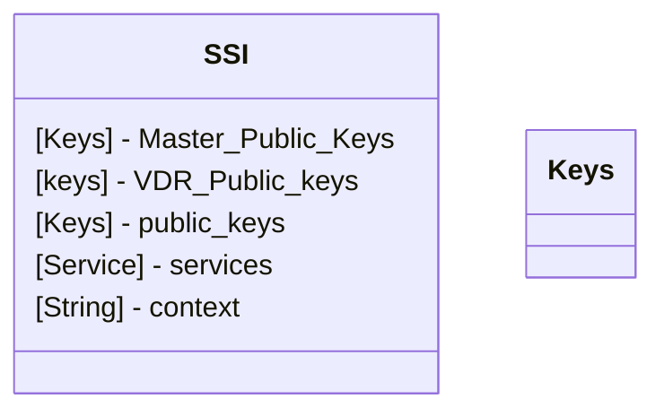
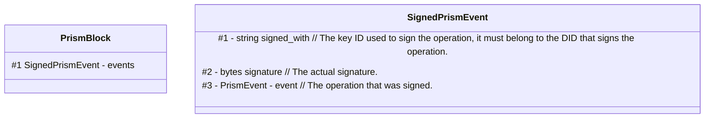
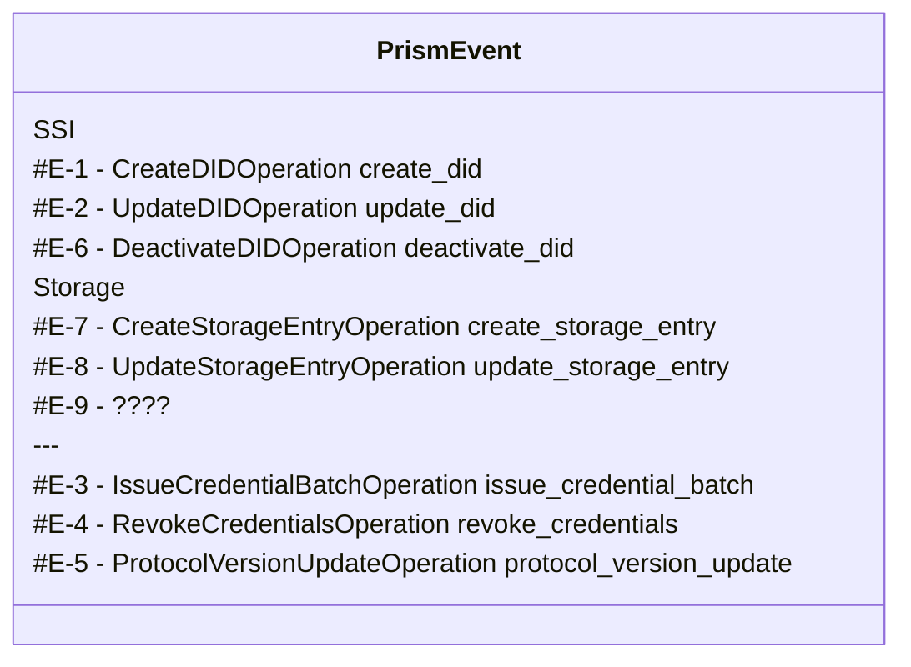
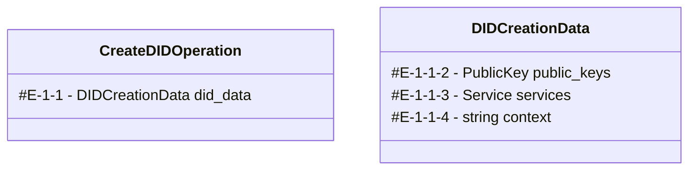
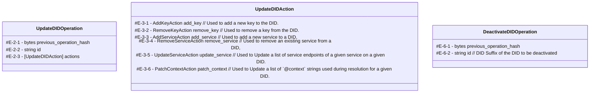
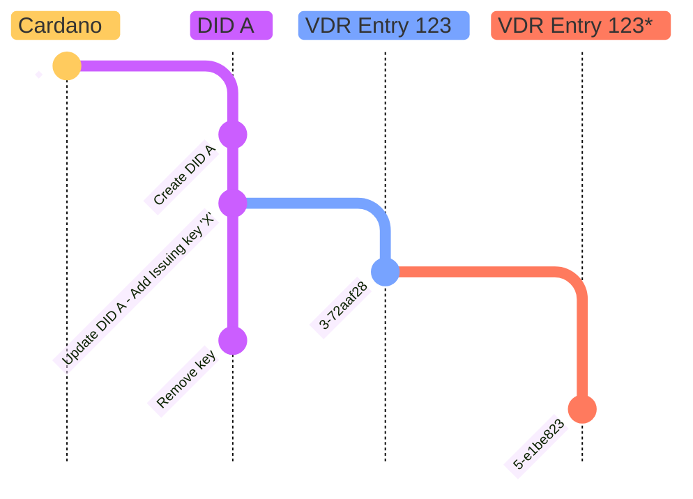
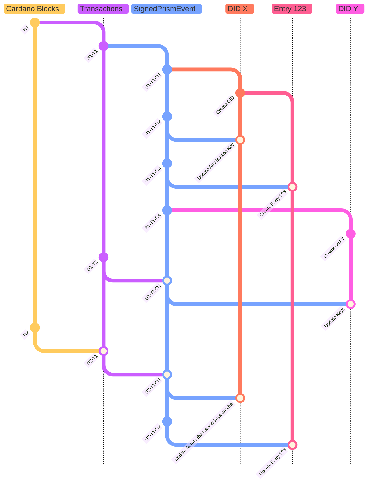

# Cardano PRISM VDR Specification

## Status of this document
 This document is a draft proposal for a Verifiable Data Registry (VDR). The document is in constant evolution, and future versions are under development. Implementers are encouraged to follow the evolution of the new versions closely to understand, provide feedback and suggest changes.

## Abstract

This Verifiable Data Registry (VDR) defines a protocol that uses the Cardano blockchain's transaction metadata to represent verifiable information/data.
This data can be updated by the entity possessing the cryptographic keys used to create the original entry.

The basic building block of this VDR is the creation of a Self-Sovereign Identity (SSI) on the Cardano Blockchain. It is as decentralized and distributed as the Cardano Blockchain.

The Verifiable Data Registry (VDR) is defined as a protocol, that describes operations, serialization formats, and rules. The protocol describes how to manage the lifecycle of VDR Entries and their associated keys and Data. We will use the term VDR Node or VDR indexer to refer to software that implements the protocol defined in this document.

This VDR/protocol is the same that is already being used by [`did:prism` DID method](https://github.com/input-output-hk/prism-did-method-spec/blob/main/w3c-spec/PRISM-method.md).
The PRISM method follows the [DID Core Specification](https://www.w3.org/TR/did-core/), creating a Decentralized Identifier (DID) on top of this Cardano VDR's SSI.

We would like to remark that, any reference to the blockchain such as, "Cardano network", "underlying chain", "on-chain", "ledger", "the blockchain" and similar ones throughout this document refer to Cardano mainnet unless explicitly said otherwise. The prism DID method, in its current form, solely depends on and uses Cardano mainnet.

## Protocol parameters

Parameter            | Value             | Description
-------------------- | ----------------- | -----------
CRYPTOGRAPHIC_CURVE	 | secp256k1         | Cryptographic curve used with a key.
SIGNATURE_ALGORITHM	 | SHA256 with ECDSA | Asymmetric public key signature algorithm.
HASH_ALGORITHM       | SHA-256           | Algorithm for generating hashes.
SECP256K1_CURVE_NAME | "secp256k1"       | String identifier for the SECP256K1 eliptic curve
ED25519_CURVE_NAME	 | "Ed25519"         | String identifier for the ED25519 eliptic curve
X25519_CURVE_NAME	   | "X25519"          | String identifier for the Curve25519 eliptic curve

PRISM_LABEL=21325
Cardano MetaData Label:
- 21325 is used by:
  - did:prism method - [prism-did-method-spec](https://github.com/input-output-hk/prism-did-method-spec/)
  - PRISM CredentialBatch - Specification is not public
  - Anyone else that want to for whatever reason

CRYPTOGRAPHIC_CURVE is the key type used by the master key master key. It follows the guidance of [CIP-0016 - Cryptographic Key Serialisation Formats](https://github.com/cardano-foundation/CIPs/tree/master/CIP-0016)

*NOTE* We use protobuf to encode data in order to help ensure both backward and forward compatibility in the data model.
In the rest of the document we will use the notion `E-x-y-z` to represent the path on the data models (where `<E>` is the starting model and `<x>` `<y>` `<z>` ... are the positions of the field inside of the previous model).

## Events/Opetarions

The PRISM VDR is composed of a sequence of immutable events/operations.
It uses the Cardano (mainnet) blockchain as the source of truth and order.

There are several categories of events/operations representing different entries in this VDR:
- `SSI` - aka [**prism:did**](https://github.com/input-output-hk/prism-did-method-spec/blob/main/w3c-spec/PRISM-method.md).
- IssueCredentialBatch - old format of the ATALA PRISM project to revoke VC - Verify Credentials.
- `Storage` - Will store a limited amount of data that can be updated.
- More can be added in the future - any future extension of the specification MUST BE **backwards compatible** and **forward compatible**.

Some of those entries can depend on others. Like, the `Storage` entry is associated with a `SSI` entry.

All events/operations follow an order. A timeline which the event occurs in the blockchain.
So when comparing two events we MUST be able to determine each one occurs first.
The order MUST follow the order of transactions in the blockchain in a first instance and then the order as it appear inside `PrismBlock`.

### SSI entry

The fundamental data structure of the VDR are the `SSI` entries.
Any SSI (Self-sovereign identity) entry represents a `DID`.
It also contains additional information, such as the Master Key.

The conversion between the our `SSI` entry and `DID Document` as specified by [DID Core](https://www.w3.org/TR/did-1.0/) is mention later in this document.
Following the rules well defined in the specification of [**prism:did**](https://github.com/input-output-hk/prism-did-method-spec/blob/main/w3c-spec/PRISM-method.md) 
A `did:prism` identifier is registered and recorded on the PRISM VDR.- https://www.w3.org/TR/did-core/#detailed-architecture-diagram

There are three types of events/operations for `SSI` entries.
- Create `E-1`
- Update `E-2`
- Deactivate `E-6` 

The hash HASH_ALGORITHM of the `E-1` create event serves as the reference to the SSI entry.
The `E-1` event must be signed using the private part of the Master Key specified in the event itself.
The `E-2` and `E-6` events must be signed by one of the Master Keys listed in the SSI entry’s state at the time the event occurs.

### Storage Entry

Another category of events/operations in the PRISM VDR is for **Storage Entries**.
Storage Entries are used to store mutable information, and this information will be publicly available on the Blockchain.

Note:
The amount of information stored in a Storage Entry should be relatively small.
The larger the amount of data, the more expensive it will be to submit as metadata in a transaction. Additionally, transaction metadata has hard limits.

When a Storage Entry is created, the first field, `E-7-1`, refers to the identity SSI of the creator of the Storage Entry.
The Storage Entry is also designed existe on chain, similar to the SSI Entries. The creator is allowed to send follow-up events/operations to update the content.

All events/operations must be signed by the owner (`E-7-1`) using the key type `VDR_KEY` (`...KeyUsage-8`).
The key must be valid at the time of the operation.
(Note: Keys in the SSI can be removed or rotated later, but these operations will still be valid as long as they were signed with valid keys at the time of the event.)

Like the `SSI`, the **Storage Entry** can be referenced by the hash HASH_ALGORITHM of the create storage operation.
The create Storage event `E-7` should include a nonce (`E-7-2`) to allow for the creation of multiple distinct entries with the same initial information.
Example: For use cases like the **StatusList**, where the initial value may be identical (e.g., an array of zeros representing the validity of a credential), the nonce (`E-7-2`) ensures the creation of multiple distinct Storage entries.

Also, like the `SSI`, it should be possible to resolve the Storage Entry to a point in time.
By default when resolving the Storage Entry it SHOULD return the latest state of the entry.

There are three types of events/operations over **Storage entries** (see protobuf definition):
- Create (CreateStorageEntryOperation) `E-7`
- Update (UpdateStorageEntryOperation) `E-8`
- Deactivate `E-9? TODO` ?????????????????????????????????????????????

The creation of a **Storage Entry** is associated with one SSI entry (the owner).
For the Storage Events (`E-7`, `E-8`, `E-9`) to be considered valid, they must meet the following criteria:
- the event must have a valid signature.
- it must be signed by the owner's key, using:
  - the `SIGNATURE_ALGORITHM`
  - the curve `SECP256K1_CURVE_NAME`
  - the purpose `#KeyUsage-8` (VDR_KEY)
- the keys used must be present in the SSI at the time of the event. (Key rotation after the event does not invalidate the Storage entries.)
- the SSI owner (`E-7-1`) must not be deactivated. Otherwise the **Storage entries** SHOULD be considered deactivated.


#### Types of Storage Entries

There are several types of Storage entries, each with its own rules for creation and updates.

**Future extensions to this document may introduce more types of storage entries.**

If the PRISM Indexer encounters an `UNKNOWN` type in the protobuf fields of events `E-7` and `E-8`, it may ignore the content of that particular Storage Entry.
However, the existence of the Storage Entry must still be recognized, verified, indexed, and any related events should be returned. In cases of unsupported types, the resolved content can be left blank or empty.

Users of the indexer SHOULD always have the opportunity to get all the associated events. So they can locally verified and resolve the content.  

The data type for a Storage Entry is defined by the create event/operation. Depending on the filter used in the data, the following types of information/data may be stored:
- `E-7-3` - **bytes**: Represents a raw array of bytes.
- `E-7-4` - **Token Status List**: Represents a status list, as defined by https://datatracker.ietf.org/doc/draft-ietf-oauth-status-list/10/
- `E-7-5` - **bitstring_status_list**: ????
- `E-7-?` - **CID (content identifier)**: A reference to an IPFS document.


##### Storage Entry - bytes

This data type is designed to represent array of bytes with fixed size.
To create the entry simple 
The field `E-7-3` is the inicial array of bytes that the content of this entry will have.
The field `E-8-3` is a array of bytes and will replace the previous content of the state with the new.


##### Storage Entry - Token Status List

This data type is designed to represents a status list, as defined by https://datatracker.ietf.org/doc/draft-ietf-oauth-status-list/10/

To create a Storage Entry of this type the `E-7` must have the field `E-7-4` defined.
The 

##### Storage Entry - CID

This data type represented the **CID (content identifier)** of a document that should be on the **Interplanetary File System (IPFS)**. 

Note that this protocol (PRISM VDR) only stores a CID as the content. They real content should be retrieved from a IPFS Gateway.
In

**Security considerations** - 
The **CID** is a reference to immutable data but also a hash of the data it self.
So it is recommended that when retrieving the data to verify this is the real data corescoing to that CID.

**Data Persistence considerations** -
Since **IPFS** relies on nodes voluntarily storing data, there is no guarantee that data will be stored permanently.
So for some use cases the actors may consider pining the data thyself in order to guarantee the Data Persistence.


## Algorithms

### Algorithm SSI object from the sequence of events.

Any Self-Sovereign Identity in this VDR is sequence of Events/Operations that form a chain.
The frist element of the chain MUST contain the `E-1` create identity event.
The HASH of the `SignedPrismEvent` with the `E-1` is the reference of the SSI.
The signature in `SignedPrismEvent #2` in sign by one of the MASTER_KEY type `KeyUsage-1` contain the create Event `E-1`. So it is Self sign.

Lets consider the folowing class. This is just a example to ilustrate the transformation of the set of events chain into a object that represent all the information of the SSI.




So the fileds `public_keys`; `services`; `context` are a direnct copy of the create event `E-1`
Note the public Master keys and public VDR keys MUST be of the keys of the type `SECP256K1_CURVE_NAME`. Those keys will be used by the PRISM Node, PRISM Indexer and othets libs to validate the chains of each SSI.
If another curve is used on those keys, the keys Should be igored.

On saction ???? with will describe how to converted from this SSI struture into the DID Document. 

This SSI struture can be update with update events `#E-2` or deactivate with `#E-6`

### Algorithm DID Document from the SSI object

Note: Storage object depends on the SSI object. But just the latest (most up update) version of the SSI.

For more documentation ref to [**prism:did specs**](https://github.com/input-output-hk/prism-did-method-spec/blob/main/w3c-spec/PRISM-method.md).

But the sumany the DID only exist if the SSI is create `#E-1` and not deactivate `#E-6`.
The DID Docuemtn is a simplacy version of the lasters status of the SSI.
That does not contains the `MASTER_KEY`; `ISSUING_KEY`; `VDR_KEY`.

Note: There are usa case where the SSI entry is not used as a DID. For example if you cares about managing Storage Entry.
The Prism Indexer MUST still be able to resolve that DID, even is the only field in the DID Document is the `id` of the DID it self.

So `{"id":"did:prism:00592a141a4c2bcb7a6aa691750511e2e9b048231820125e15ab70b12a210aae"}` its a valid DID Document.

### Algorithm Storage object from the sequence of events.

Note: Storage object depends on the SSI object. To validade the Storage entries its neesasary to resolve the SSI at the exact point in time. 

For this algorithm lets consided as a valid keys to sign the Prism Events/Operations all key in the ower's SSI with the `#KeyUsage-8` (VDR_KEY) and with the curve `SECP256K1_CURVE_NAME` on the moment that the events occurs. 

## Document History

0. Initial draft

## Authors and Contributors

- **Fabio Pinheiro** <br>
  [Email: fabio.pinheiro@iohk.io](mailto:fabio.pinheiro@iohk.io) <br>
  [Github: FabioPinheiro](https://github.com/FabioPinheiro)

---

### Appendices


## Appendix A - Events/Operations


Events:









```
classDiagram
class KeyUsage
KeyUsage : #KeyUsage-0 UNKNOWN_KEY
KeyUsage : #KeyUsage-1 MASTER_KEY
KeyUsage : #KeyUsage-2 ISSUING_KEY
KeyUsage : #KeyUsage-3 KEY_AGREEMENT_KEY
KeyUsage : #KeyUsage-4 AUTHENTICATION_KEY
KeyUsage : #KeyUsage-5 REVOCATION_KEY
KeyUsage : #KeyUsage-6 CAPABILITY_INVOCATION_KEY
KeyUsage : #KeyUsage-7 CAPABILITY_DELEGATION_KEY
KeyUsage : #KeyUsage-8 VDR_KEY
```


---
# WIP
---

## TODO 
- ideas
  - Should the storage entry `E-7` `E-8` have a time to live also?
---

### Interoperability
#### DID's service type "PrismVDR"
#### VDR Driver

---
---
---
---


## Appendix B - 

## Axexos

---
---
---


## Notes

We are increasing the capabilities of the PRISM VDR!
PRISM VDR is a generalization of the PRISM DID!

This VDR was a notion of Cardano time.
The Cardano Blockchain was boxs of transactions. Each transaction can have metadata with a PRISM Block. Each PRISM block can have a Sequence of Sign Operations.
So all PRISM operations was an order between them.

https://github.com/input-output-hk/prism-did-method-spec/issues/46

- Tackled the question about Historical information in `did:prism` method - https://github.com/input-output-hk/prism-did-method-spec/issues/43


## Indexer

Design goals:
- The Indexer MUST be deterministic.
- The Indexer MUST be able to rever all steps to a previous `Cardano Block`.
  Ideally, we recommend that the index is able to backtrack all the steps and unapply. 
- It's not responsibility of the Indexer to validate the signature of the PRISM Operation.
- The Indexer is discribed for the general use case.


### Storage entries

Each entry is by definition unique `Protubuf data of the PRISM Operation` + `Operation Order index (age of the operation)`
All correct formated 'PrismObject' Protocol

### Storage entries

Each entry is by definition unique `Protubuf data of the PRISM Operation` + `Operation Order index (age of the operation)`
All correct formated 'PrismObject' Protocol

### Operation Order Index (unique index entries)
  
The goal is to index all the blockchain metadata (with PRISM_LABEL) and with a PrismObject

Index: **`'block_height' - Cardano Block index` + `Trasation index` + `PRISM Operation index`** into a Hash of the PRISM Operation

### PRISM Operation Hash Index (index over the storage entries but is not unique)

The goal is to have all PRISM Operation

Index: the Hash of the PRISM Operation into the entry.

The index is not unique because anyone can submit multiple times (but will have `Operation Order index`).
Although we only care about the oldest operation in the Blockchain.

###  Self-sovereign identity (SSI) index

The goal of this index all he Self-sovereign identity.
In [prism:did](https://github.com/input-output-hk/prism-did-method-spec/blob/main/w3c-spec/PRISM-method.md) this in the DID's specificId

### Storage

Another objects in the PRISM VDR are Storage Entry.
The Storage entries are used to store information. All the information will be publicly available in the Blockchain.
The Storage Entry is also designed to be a chain. So data can be modified by the owner.
The amount of information/data on the Storage Entry is SHOULD be relatively small. Also the bigger the amount og information the more expensive will be to submit as metadata in a transaction. This transaction metadata also have hard limits.

There are different types of information, from Raw Byte to specific cases.

The creation of a Storage Entry is associated one SSI entry (the onwer).
Any  must be .
For the Storage Events (CreateStorage/UpdateStorage) to be valid it must:
- have a valid signature.
- be signed by onwer's key
  - using the $SIGNATURE_ALGORITHM
  - with the curve $SECP256K1_CURVE_NAME
  - with the purpose KeyUsage 8 (VDR_KEY)
- have the keys presented on the SSI, at the time of the Event. (So rotating the key after does not invalidated the Storage entries.)
- the SSI (onwer) must not be deactivated.


#### Storage Create Event

This Event event create a Storage Entry.
The storage owne by the `ssi_ref (1)`
The hash of this Event will be used as the reference/id of this entry.

```proto
message StorageEventCreateEntry {
  bytes ssi_ref = 1; // Same as the specificId of the did:prism.
  oneof data {
    bytes bytes = 2;
  }
}
```

#### Storage Update Operations

The Update event modifi/update the Storage Entries.

```proto
message StorageEventUpdateEntry {
  bytes previous_event_hash = 1; // The hash of the most recent event that was used to create or update the Storage Entry.
  oneof data {
    bytes bytes = 2
  }
}
```

#### Storege data type Bytes

The create event its a simple array of bytes. Field  `bytes (2)` it includes the initial data.
The update event its will replate the bytes with the new set of bytes in `bytes (2)`.
 

#### Storege data type BitstringStatusList
https://www.w3.org/TR/vc-bitstring-status-list/#bitstringstatuslist

#### Storege data type StatusList
// Token Status List https://datatracker.ietf.org/doc/draft-ietf-oauth-sd-jwt-vc/:
// https://datatracker.ietf.org/doc/draft-ietf-oauth-status-list/06/


#### What this Storage is not good for

Store Schemas in VDR is a bad usecase.
A Schema is more like an Ontology.
Schemas should be immutable.
Schemas should not have ower.
IPFS is a better place to store Schemas

## Future work

CIP-0008 -> https://github.com/cardano-foundation/CIPs/tree/master/CIP-0008

## TODO


Rename types in prism-did.proto to be more Generic (SSI)!


https://docs.blockfrost.io/#tag/cardano--metadata
curl -H 'project_id: $BLOCKFROST_PROJECT_ID' "https://cardano-mainnet.blockfrost.io/api/v0/metadata/txs/labels/21325?count=1&page=100&order=asc" | jq
curl -H "project_id: $BLOCKFROST_PROJECT_ID" "https://cardano-mainnet.blockfrost.io/api/v0/blocks/eb625cdac8f97791b2fc7d86057b26179e2c08f772411e43809afc6d997f900a/txs"
curl -H "project_id: $BLOCKFROST_PROJECT_ID" "https://cardano-mainnet.blockfrost.io/api/v0/txs/17dfa3cb53c3c64b015241c120b3081a6e32e96829274fee70bb312f36373f02/metadata" |jq

  val Mainnet = "https://cardano-mainnet.blockfrost.io/api/v0"
  val Preprod = "https://cardano-preprod.blockfrost.io/api/v0"
  val Preview = "https://cardano-preview.blockfrost.io/api/v0"
  val Testnet = "https://cardano-testnet.blockfrost.io/api/v0"

curl -H 'project_id: $BLOCKFROST_PROJECT_ID' "https://cardano-mainnet.blockfrost.io/api/v0/metadata/txs/labels?count=1&page=2013&order=asc" | jq
[
  {
    "label": "21325",
    "cip10": null,
    "count": "6453"
  }
]




checkout DID_A


  
Notes:

1- We need to be able to resolve any PRISM DID at the specific point on time
2- All PRISM operations needs to be ordered!
If the key that created, the VDR is rotated or removed the VR is still valid?!
All VDR is related to a DID? This might not be good




  <!-- merge "SignedPrismEvent" id: "Update Issuing key another"
  cherry-pick id:"B2-T1-O1" parent:"B2-T1"
  commit id: "Update Issuing key another2" -->
